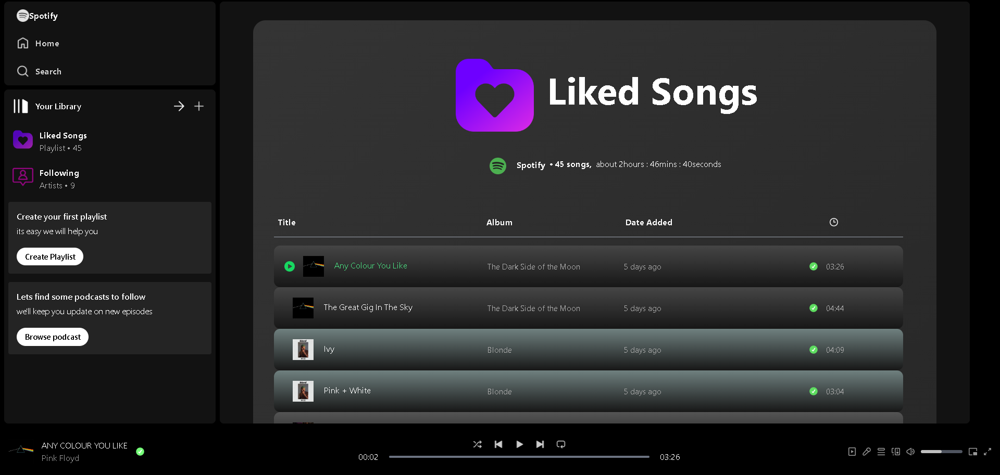
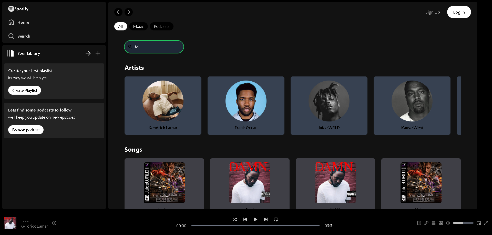

# Spotify Clone

Welcome to the Spotify Clone, a music streaming application built using React.js, Express, Node.js, and MongoDB. This project replicates the core functionalities of Spotify, allowing users to search for songs, play music, manage playlists, and explore artists.

You can see a video of the app here : 

## Table of Contents

- [Features](#features)
- [Screenshots](#screenshots)
- [Usage](#usage)
- [License](#license)
- [Contact](#contact)

## Features

- **Play Music**: Listen to your favorite songs with a built-in music player.
- **Album Navigation**: Browse albums and select songs from any album.
- **Song Information**: View song details including title, album, artist, and more.
- **Lyrics Display**: Click the lyrics button to view song lyrics.
- **Search Functionality**: Search for artists or song titles.
- **User Authentication**: Login to like songs and artists.
- **Liked Songs & Artists**: View and manage your liked songs and artists.
- **Queue Management**: Add songs to a queue to play next.
- **Shuffle Function**: Shuffle songs to play random tracks.
- **Volume Control**: Adjust the volume to your preference.

## Screenshots

## Usage

- **Explore Music**: Navigate through albums and artists to find music.
- **Manage Queue**: Use the queue feature to organize upcoming songs.
- **Like & Browse**: Log in to like songs and artists, and access them from your profile.
- **Search**: Utilize the search bar to find specific songs or artists.
- **Adjust Playback**: Control playback with volume and shuffle options.

## Contact

For any questions or feedback, please contact:

- **Your Name**: [foxfireninetails9@gmail.com](mailto:foxfireninetails9@gmail.com)
- **GitHub**: [qbeeeeee](https://github.com/qbeeeeee)
